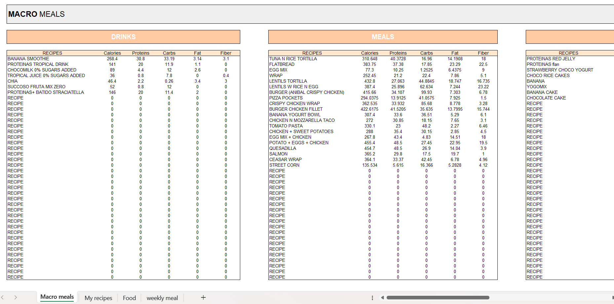
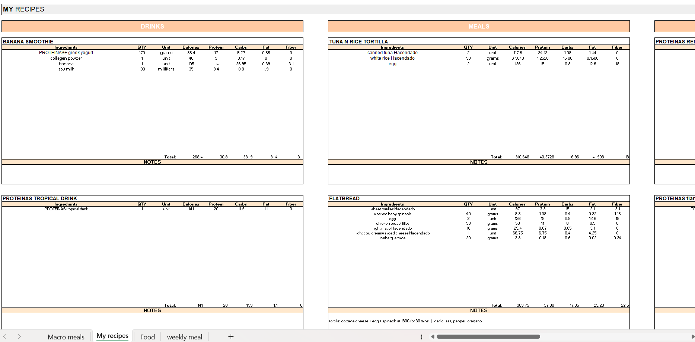
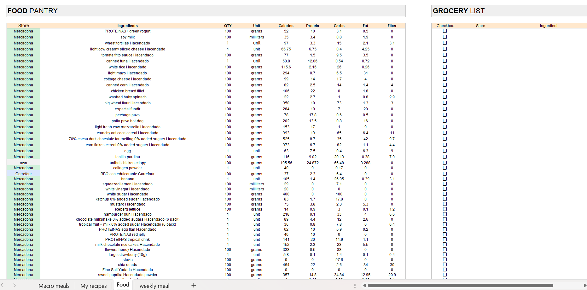
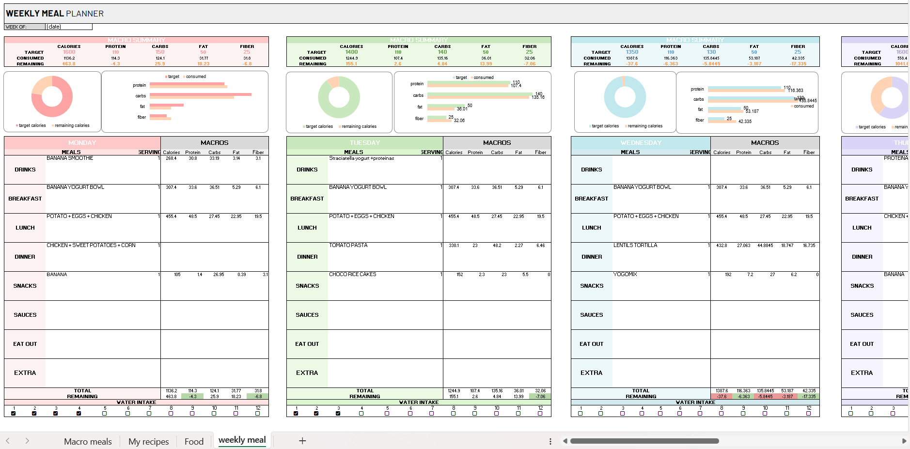

#  Excel Macro Meal Planner & Nutrition Tracking System

> **Interactive Excel-based nutrition planning, data management, and macro tracking system**

This is an interactive **Excel data-management and automation system** designed to organize recipes, ingredients, nutritional information, meal planning, and weekly nutrition targets in a connected workbook. Rather than manually calculating nutritional values for every meal, the workbook uses interconnected sheets, formulas, dropdown selections, calculated fields, and conditional formatting to automatically propagate changes throughout the planning system.

---

## Project Objectives

The main objectives were to:

- Centralize nutritional information for ingredients and recipes.
- Avoid repeatedly entering nutritional information manually.
- Automatically calculate nutritional values based on ingredient quantities.
- Connect recipes to their underlying ingredients.
- Build a weekly meal-planning system using dropdown selections.
- Automatically calculate daily macro totals.
- Compare consumed values against predefined nutritional targets.
- Provide immediate visual feedback when targets are met or exceeded.
- Create a reusable and scalable spreadsheet structure.
- Practice transforming a personal-use spreadsheet into a structured data system.

---

#  Workbook Architecture

The workbook is divided into four primary components:

```text
Macro Meal Planner
│
├── Macro Meals
│   └── Central recipe/nutrition database
│
├── My Recipes
│   └── Individual recipes and ingredient quantities
│
├── Food
│   └── Ingredient/nutrition database
│
└── Weekly Meal
    └── Weekly planning and nutrition dashboard
````

The sheets are interconnected so that changes made at the ingredient level can propagate through recipes and ultimately into the weekly meal planner.

---

# 1. Macro Meals

The **Macro Meals** sheet acts as a centralized reference for recipes.

Each recipe contains nutritional information such as:

* Calories
* Protein
* Carbohydrates
* Fat
* Fiber

The sheet allows the rest of the workbook to retrieve nutritional information without requiring the user to manually recalculate each meal.

Example structure:

| Recipe                  | Calories | Protein | Carbs | Fat | Fiber |
| ----------------------- | -------: | ------: | ----: | --: | ----: |
| Banana Smoothie         |      ... |     ... |   ... | ... |   ... |
| Tuna & Rice Tortilla    |      ... |     ... |   ... | ... |   ... |
| Potato + Eggs + Chicken |      ... |     ... |   ... | ... |   ... |

This effectively acts as a lightweight **recipe/nutrition lookup table**.




---

#  2. My Recipes

The **My Recipes** sheet contains the detailed composition of individual recipes.

Instead of entering nutritional information manually for every ingredient, ingredients can be selected and their corresponding information is retrieved from the food database.

For each recipe, the workbook tracks information such as:

* Ingredient
* Quantity
* Unit
* Calories
* Protein
* Carbohydrates
* Fat
* Fiber

Nutritional values are calculated based on the quantity of each ingredient.

For example:

```text
Ingredient → Quantity → Nutritional Database
                    ↓
              Calculated Macros
                    ↓
                Recipe Total
```

Changing an ingredient quantity therefore changes the nutritional values associated with that ingredient and contributes to the updated recipe totals.




---

#  3. Food

The **Food** sheet serves as the ingredient-level nutrition database.

It contains the foods and ingredients used throughout the workbook together with their nutritional information.

Typical fields include:

* Food / ingredient name
* Quantity
* Unit
* Calories
* Protein
* Carbohydrates
* Fat
* Fiber

The database contains many products and ingredients commonly available in **Spain**, reflecting the environment in which the workbook was created.

Examples include products from Spanish supermarkets and food brands, as well as common ingredients and products available in the Spanish market.

The sheet acts as the underlying source for the recipe calculations.



---

#  4. Weekly Meal Planner

The **Weekly Meal** sheet is the main user-facing planning interface.

The user can select meals using dropdown menus for different meal categories, including:

* Drinks
* Breakfast
* Lunch
* Dinner
* Snacks
* Sauces
* Eating out
* Extras

Once a recipe is selected, its nutritional information is automatically retrieved.

The user can then adjust the serving quantity, which causes the nutritional totals to update automatically.

The planner therefore follows the structure:

```text
Recipe Database
       ↓
Recipe Selection
       ↓
Serving Quantity
       ↓
Daily Nutrition Calculation
       ↓
Weekly Nutrition Overview
```

---

# 📈 Macro Dashboard

Each day in the weekly planner contains a macro summary showing:

* Target Calories
* Consumed Calories
* Remaining Calories
* Target Protein
* Consumed Protein
* Target Carbohydrates
* Consumed Carbohydrates
* Target Fat
* Consumed Fat
* Target Fiber
* Consumed Fiber

The workbook also includes visualizations such as:

* Donut charts
* Target vs. consumed comparisons
* Macro progress bars
* Remaining/consumed summaries

This turns the spreadsheet from a simple table into an interactive **personal analytics dashboard**.



---

#  Conditional Formatting

Conditional formatting is used to provide immediate feedback about nutritional targets.

For example, macro totals can change visual status depending on whether the target has been reached or exceeded.

Conceptually:

```text
Target
   │
   ├── Below target → Remaining
   │
   ├── Target reached → Target met
   │
   └── Target exceeded → Warning
```

This makes potential issues immediately visible without requiring the user to manually inspect every value.

---

#  Data Flow

The workbook follows a simple data flow architecture:

```text
                    ┌──────────────────┐
                    │   FOOD DATABASE  │
                    │                  │
                    │ Ingredients      │
                    │ Nutrition        │
                    └────────┬─────────┘
                             │
                             ▼
                    ┌──────────────────┐
                    │   MY RECIPES     │
                    │                  │
                    │ Ingredients      │
                    │ Quantities       │
                    │ Recipe Macros    │
                    └────────┬─────────┘
                             │
                             ▼
                    ┌──────────────────┐
                    │   MACRO MEALS    │
                    │                  │
                    │ Recipe Database  │
                    └────────┬─────────┘
                             │
                             ▼
                    ┌──────────────────┐
                    │ WEEKLY MEAL      │
                    │     PLANNER      │
                    │                  │
                    │ Meal Selection   │
                    │ Servings         │
                    │ Daily Totals     │
                    │ Visualizations   │
                    └──────────────────┘
```

This structure allows information to be entered at the lowest level and reused throughout the workbook.

---

#  Excel Functionality

The workbook makes extensive use of Excel's built-in functionality to automate calculations and reduce repetitive data entry.

Key concepts include:

* Cell formulas
* Cross-sheet references
* Lookup operations
* Calculated nutritional values
* Dropdown lists
* Data validation
* Conditional formatting
* Automatic totals
* Dynamic calculations
* Dashboard-style visualizations

The goal was to create a system where the user interacts primarily with **selections and quantities**, while Excel performs the underlying calculations.

---

#  Quantity-Based Calculations

One of the core features is the ability to change ingredient or meal quantities while automatically recalculating nutritional values.

For example, if an ingredient contains:

```text
100 g
200 kcal
20 g protein
```

and the quantity is changed to:

```text
150 g
```

the corresponding nutritional values are recalculated proportionally. This minimizes manual calculation and reduces the possibility of transcription errors.

---

#  Data Validation & Dropdowns

Dropdown menus are used throughout the workbook to make selections easier and maintain consistency.

For example, in the weekly planner, a meal can be selected from the available recipes rather than manually typing its name.

This provides:

* Consistent naming
* Reduced input errors
* Faster meal planning
* Automatic connection to the recipe database
* Easier maintenance when recipes are added

The same concept is used when selecting ingredients for recipes.

---